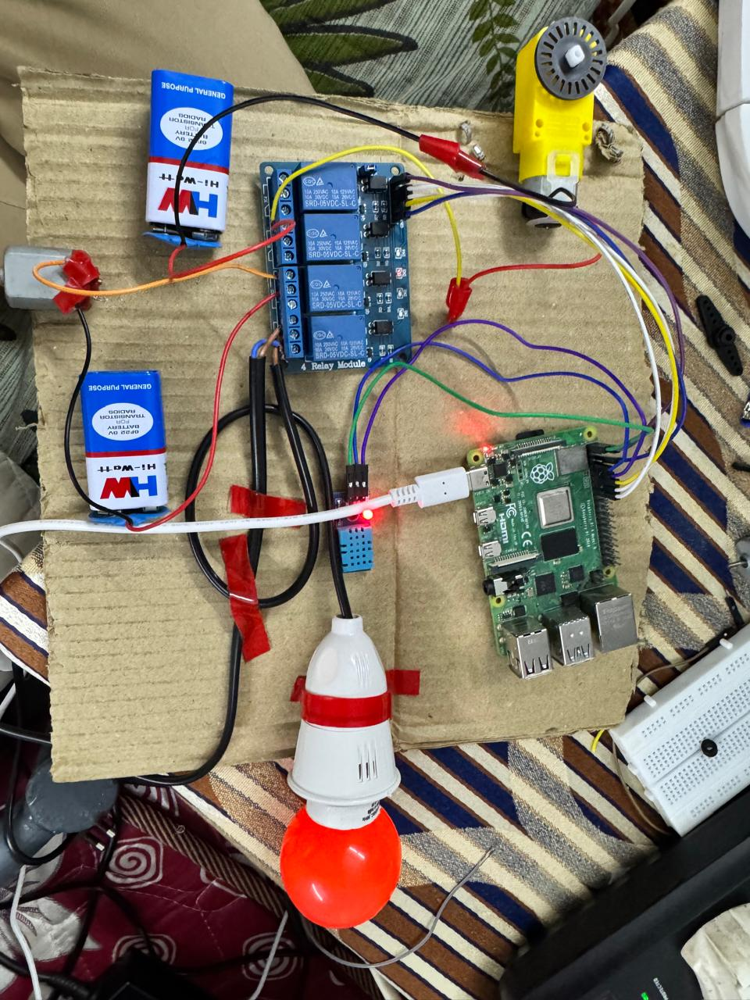

# Smart Home Automation with Voice and Gesture Control



## Overview

This project implements a smart home automation system that allows users to control home appliances using both voice commands and hand gestures. The system integrates hardware control (GPIO), sensor data (DHT11), and a web-based dashboard for monitoring and interaction.

---

## Features

- **Voice Control:** Issue commands to control appliances using natural language.
- **Gesture Control:** Use hand gestures to operate devices without physical contact.
- **Web Dashboard:** Monitor appliance status and interact with the system via a user-friendly web interface.
- **Sensor Integration:** Real-time temperature and humidity monitoring using the DHT11 sensor.

---

## Project Structure

```
├── CNn.py                       # Core neural network or gesture recognition logic
├── demo_smart_home.jpg          # Demo image of the system
├── gesture.py                   # Gesture control logic
├── app/
│   ├── appliance_status.json    # Stores current status of appliances
│   ├── gpio_appliance_control.py# GPIO control for appliances
│   ├── last_command.txt         # Stores the last command issued
│   ├── run_all.sh               # Shell script to run all services
│   ├── sarvamAPI2.py            # Main API logic
│   ├── voice_command_handler.py # Voice command processing
│   ├── DHT11/
│   │   ├── dht_data.json        # Sensor data storage
│   │   └── DHT11.py             # DHT11 sensor interface
│   ├── static/
│   │   ├── dashboard.css        # Dashboard styles
│   │   ├── dashboard.js         # Dashboard scripts
│   │   ├── voice_page.css       # Voice page styles
│   │   └── voice_page.js        # Voice page scripts
│   └── templates/
│       ├── dashboard.html       # Dashboard HTML
│       └── voice_page.html      # Voice page HTML
```

---

## How It Works

1. **Voice Commands:**
   - Users speak commands, which are processed by `voice_command_handler.py`.
   - The system interprets the command and updates appliance status via `gpio_appliance_control.py`.

2. **Gesture Recognition:**
   - Gestures are detected using the logic in `gesture.py` and/or `CNn.py`.
   - Recognized gestures trigger appliance control actions.

3. **Web Dashboard:**
   - The dashboard (HTML/CSS/JS in `app/static` and `app/templates`) displays real-time status and allows manual control.

4. **Sensor Data:**
   - The DHT11 sensor provides temperature and humidity data, managed by `DHT11.py` and stored in `dht_data.json`.

---

## Setup & Usage

1. **Install Dependencies:**
   - Ensure Python and required libraries are installed (see code for details).

2. **Run the System:**
   - Use the provided `run_all.sh` script (Linux) or run the main Python scripts individually on Windows.

3. **Access the Dashboard:**
   - Open the web dashboard in your browser to monitor and control appliances.

---

## Demo

The image above (`demo_smart_home.jpg`) shows the system in action, demonstrating both the hardware setup and the web dashboard interface.

---

## Authors & Credits

- Project by Scientists
- For academic, research, or personal use.

---

## License

This project is provided for educational purposes. Please check individual files for license details if present.

